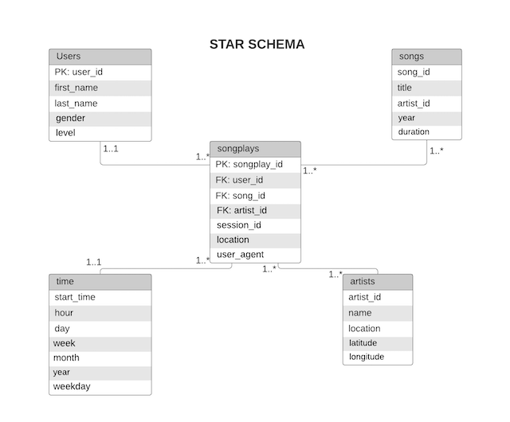

# Sparkify Song Analysis ETL Pipeline
This package contains an ETL Pipeline and a Database Schema to support the analytic queries required by Sparkify.

## Architecture 
All the  data is currently stored in files, we use Pandas to ingest the data, transform it and store it in a star schema for easy analysis

### ERD Diagram (Star Schema)

## ETL Flow
- Data is sourced from app logs and a song files folder
- We use python to locate JSON files in the directories
- The data is loaded into Pandas
- Pandas transforms and loads the data into DataFrames
- Using Python we insert the data into Postgres database

## Installation
### Prerequisites
1. Python
2. Pandas
3. psycopg2 - Python database interface 

The package contains a `create_tables.py` script which should be run before running the etl process. This script creates the necessary tables that will be used in the etl process
The ETL pipeline is contained in `etl.py`

### How To Run
- Open terminal and change to root
- Setup the database by running `python create_tables.py`
- Run the ETL process by running `python etl.py`
